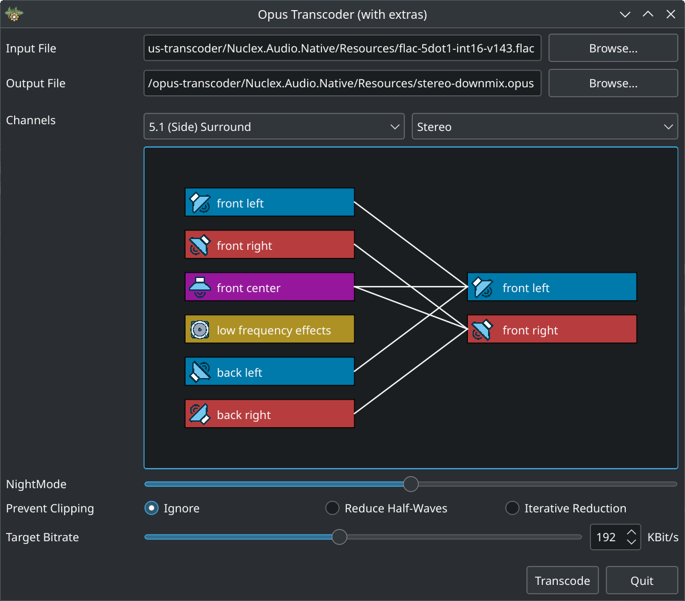

Nuclex Opus Transcoder
======================

This is a small utility that transcodes different lossless audio codecs,
currently FLAC, Wavform and WavPack, into high quality Opus files.
All encoding and decoding is done directly through the reference libraries
of each codec (inside Nuclex.Audio.Native) and there's a convenient Qt GUI.

Note that you can do most of what this tool does via ffmpeg or even Audacity
if you need a GUI. There are some special features here, though.

This application also serves to demonstrate the Nuclex.Audio.Native library
which is used for all informaiton gathering, encoding and decoding.

Supported Channel Layouts
-------------------------

This application is tailored for music and movie audio tracks. The channel
layouts it supports as input are mono, stereo, 5.1 and 7.1 (other details,
such as the differing channel orders between FLAC/Waveform/WavPack and
Vorbis/Opus, are taken care of automaticlly).

Depending on the input channel layout, the right combo box in the main window
will let you pick a different output channel format, causing either a downmix
or an upmix to be performed.

Downmixing 7.1 to 5.1
---------------------

Downmixing a 7.1 surround audio track to 5.1 simply sums the back and side
channels assuming the channels follow the Dolby specification (the total is
not halved in the summed channels).

https://professionalsupport.dolby.com/s/article/How-do-the-5-1-and-Stereo-downmix-settings-work
https://www.audiokinetic.com/en/library/edge/?source=Help&id=downmix_tables#tbl_5x

Downmixing 7.1 / 5.1 to Stereo + Nightmode
------------------------------------------

Downmixing a 7.1 or 5.1 surround audio track to stereo can use either
the standard ATSC formula or a custom formula suggested by a user named
"Nightmode" on the Doom9 forums. The "Nightmode" formula usually makes
spoken dialogue louder and easier to hear, but some 5.1 and 7.1 surround
productions use unusual channel mixes following their own logic.

https://www.audiokinetic.com/en/library/edge/?source=Help&id=downmix_tables#tbl_stereo
https://forum.doom9.org/showthread.php?t=168267

Upmixing Mono to Stereo
-----------------------

Some older movies come with mere mono audio tracks. These are upmixed
to stereo, always.

Because stereo is the lowest standard nowadays, the volume is not reduced
to 0.707, instead the mono channel is duplicated straight into the front left
and front right channels at its original volume.

Normalization
-------------

When enabled, normalization will measure the peak volume of the input
audio track and increase its volume such that the peak volume then sits
at the maximum output level.

Normalization in this application never reduces the volume, it only
normalizes up.

- Stereo channels will be normalized together rather than independently

- If the input is a 5.1 or 7.1 surround audio track, the positional tracks
  are normalized together (because otherwise, the surround positioning
  would be alterend and surround mix is supposed to keep the overall volume
  to the same level as stereo, not use the additional speakers for yield)

- If an LFE track is present, it will be normalized independently. That
  might mean that movie tracks with gentle rumbling might become more intense.

Declipping: Single-Pass
-----------------------

All declipping done by this application is actually "peak tucking" - it does
not synthesize lost peaks or such. Use professional audio software for that.

This declipper assumes you happily mastered your audio track in Audacity or
similar and saved it directly to floating point, with peaks exceeding
amplitudes of 1.0 on occasion (i.e. your mastered track has occasional peaks
beyond 1.0, but it is NOT generally breaking the signal ceiling).

It then finds those peaks, scans for their surrounding half-wave (the part of
the audio waveform that is on the same side of the center line), then shrinks
that entire half-wave until the peak is within the valid range.

For gentle, occasional clipping (the floating point, peak-preserving kind),
this retains audio quality and produces a conformant Opus file.

Declipping: Iterative
---------------------

This is the same "peak tucking" technique as done by the single-pass
declipper, but instead of being applied to the input audio waveform,
the file is first encoded to Opus, then decoded again and the resulting
Opus waveform is scanned for clipping peaks.

Any clipping peaks (Opus can and does produce floating point samples
going slightly above the signal ceiling) are then located in
the untouched input audio waveform, fixed therein and the entire
encode + decode stage runs again. This is continued until no clipping remains
or until the left-over clipping peaks stubbornly refused to become smaller
even though their input waveform has been scaled down 10 times (with
increasing volume quotients).

The resulting Opus file will then have no clipping when decoded using
its reference implementation (which is used by all audio players generally).
